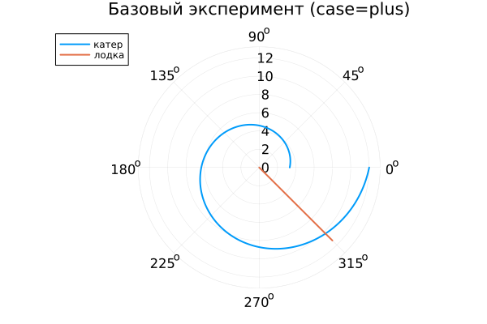

---
## Author
author:
  name: Алькамаль Ибрахим
  email: 1032225432@rudn.ru
  affiliation:
    - name: Российский университет дружбы народов
      country: Российская Федерация
      postal-code: 117198
      city: Москва
      address: ул. Миклухо-Маклая, д. 6

## Title
title: "Математическое моделирование"
subtitle: "Лабораторная работа № 2"
license: "CC BY"
---

# Цель работы

Рассмотрим пример построения математической модели, позволяющей выбрать корректную стратегию в задачах поиска и преследования.  
В качестве иллюстрации возьмём ситуацию с погоней: в тумане катер береговой охраны преследует лодку браконьеров. В некоторый момент видимость улучшается, и лодка обнаруживается на расстоянии $k$ км от катера. Затем туман снова сгущается, а лодка продолжает движение прямолинейно в неизвестном направлении. Известно, что скорость катера в $n$ раз превосходит скорость лодки.  
Требуется определить траекторию, по которой катер должен двигаться, чтобы гарантированно догнать браконьеров.

# Задание

1. Выполнить рассуждения и получить дифференциальные уравнения движения при условии, что скорость катера больше скорости лодки в $n$ раз.
2. Построить траектории катера и лодки для двух вариантов начальных условий.
3. По графику определить точку пересечения траекторий (момент встречи).

# Выполнение лабораторной работы

Положим $t_0=0$. Точку обнаружения лодки примем за начало отсчёта: $x_0=0$.  
Пусть в момент обнаружения катер находится на расстоянии $k$ от лодки, то есть его положение относительно полюса соответствует $r=k$ (в принятой ниже системе координат).

Перейдём к полярным координатам. Считаем, что полюс — это точка, где лодка была замечена: $x_0=0$ (то есть $\theta=x_0=0$), а полярная ось $r$ направлена через положение катера береговой охраны в момент наблюдения.

## Поиск расстояния $x$ для смены режима движения

Найдём расстояние $x$ от полюса, на котором катеру целесообразно перейти от прямолинейного движения к обходу вокруг полюса. Предположим, что через время $t$ лодка и катер окажутся на одинаковом расстоянии $x$ от полюса.

За это время лодка проходит путь $x$, а катер — либо $x+k$, либо $x-k$ (в зависимости от того, как интерпретируется начальная конфигурация относительно полюса). Время прохождения равно:
- для лодки: $t=\frac{x}{\upsilon}$,
- для катера: $t=\frac{x+k}{n\upsilon}$ (первый вариант) или $t=\frac{x-k}{n\upsilon}$ (второй вариант),

так как скорость катера равна $n\upsilon$.

Поскольку время одно и то же, получаем уравнения:

- **случай 1 (plus):**  
  $$\frac{x}{\upsilon}=\frac{x+k}{n\upsilon},$$

- **случай 2 (minus):**  
  $$\frac{x}{\upsilon}=\frac{x-k}{n\upsilon}.$$

Отсюда находятся два значения расстояния (для двух сценариев):

$$x_1=\frac{k}{n+1}, \quad \theta=0,$$

$$x_2=\frac{k}{n-1}, \quad \theta=-\pi.$$

## Разложение скорости катера и вывод системы ОДУ

После достижения одинакового расстояния от полюса (как у лодки), катер должен перейти к движению вокруг полюса, одновременно удаляясь от него с той же радиальной скоростью, что и лодка, то есть $\upsilon$.

Разложим скорость катера на компоненты:
- $v_r$ — радиальная составляющая,
- $v_t$ — тангенциальная составляющая.

Радиальная скорость:
$$v_r=\frac{dr}{dt}.$$

Требование равенства радиальной скорости лодочной скорости:
$$\frac{dr}{dt}=\upsilon.$$

Тангенциальная скорость определяется как:
$$v_t=r\frac{d\theta}{dt}.$$

Полная скорость катера равна $n\upsilon$. Компоненты образуют прямоугольный треугольник, поэтому:
$$ (n\upsilon)^2=v_r^2+v_t^2.$$

Подставляя $v_r=\upsilon$, получаем:
$$v_t=\sqrt{n^2\upsilon^2-\upsilon^2}=\upsilon\sqrt{n^2-1}.$$

Следовательно:
$$r\frac{d\theta}{dt}=\upsilon\sqrt{n^2-1}.$$

Таким образом, исходная задача сводится к решению системы:

$$
\begin{cases}
\frac{dr}{dt}=\upsilon,\\
r\frac{d\theta}{dt}=\upsilon\sqrt{n^2-1}.
\end{cases}
$$

### Начальные условия

Для двух вариантов:

$$
\begin{cases}
\theta_0=0,\\
r_0=\frac{k}{n+1},
\end{cases}
$$

$$
\begin{cases}
\theta_0=-\pi,\\
r_0=\frac{k}{n-1}.
\end{cases}
$$

Исключая параметр $t$ из системы, переходим к уравнению траектории:

$$\frac{dr}{d\theta}=\frac{r}{\sqrt{n^2-1}}.$$

При сохранении соответствующих начальных условий решение даёт траекторию катера в полярных координатах. Далее построим траектории катера и лодки для обоих случаев.

## Условие задачи

В тумане катер береговой охраны преследует лодку браконьеров.  
В момент, когда туман рассеивается, расстояние между ними составляет $20$ км. Затем лодка исчезает в тумане и движется прямолинейно в неизвестном направлении.  
Скорость катера в $5$ раз больше скорости лодки.

Для моделирования и построения графиков использовались внешние файлы с программным кодом:





## Анализ результатов моделирования

В рамках работы выполнено численное исследование движения катера, описываемого уравнением

$$
\frac{dr}{d\theta}=\frac{r}{\sqrt{n^2-1}},
$$

а также сопоставление полученной траектории с движением лодки, заданным аналитически и выраженным в полярной системе координат.

## Базовые эксперименты

### 1. Случай (case = plus)

Полярный график показывает, что путь катера представляет собой расходящуюся спираль. Радиус $r$ монотонно возрастает при увеличении угла $\theta$, причём темп роста усиливается по мере удаления от центра. Это согласуется с тем, что величина $\frac{dr}{d\theta}$ пропорциональна $r$, а значит зависимость имеет экспоненциальный характер по переменной $\theta$.

Траектория лодки — это луч, так как в декартовой системе она движется по прямой, а в полярной координатной форме такой ход описывается простой зависимостью $r$ от параметра движения.

Также заметно, что катер увеличивает радиус быстрее лодки: расстояние между кривыми возрастает.

### 2. Случай (case = minus)

Во втором режиме стартовый радиус больше, поэтому катер начинает движение дальше от полюса. Форма траектории сохраняется (та же спираль), но вся кривая сдвинута наружу, то есть отличается масштабом.

Таким образом, отличие между case=plus и case=minus определяется начальными условиями и общим «размером» спирали, тогда как качественный вид движения остаётся одинаковым.

## Параметрическое сканирование по $n$

Проведено исследование влияния параметра $n$ на характер движения катера при обоих типах начальных условий.

Из уравнения видно, что коэффициент при $r$ равен
$$\frac{1}{\sqrt{n^2-1}}.$$

При росте $n$ данный коэффициент уменьшается, следовательно:

- при малых $n$ спираль «раскрывается» быстрее;
- при больших $n$ радиальный рост замедляется;
- траектории становятся визуально более пологими.

График демонстрирует, что для $n=3$ рост самый быстрый, а для $n=10$ — самый медленный.

## Анализ метрики scale_ratio

Введём метрику

$$
\text{scale\_ratio}=\frac{r_{\text{final}}}{\max\left(r_{\text{boat}}\right)},
$$

которая отражает относительный масштаб траектории катера по сравнению с максимальным радиусом лодки.

По графику видно:

- при малых $n$ метрика заметно превышает $1$, то есть катер уходит по радиусу существенно дальше лодки;
- при увеличении $n$ значение резко падает;
- при больших $n$ масштабы траекторий становятся ближе друг к другу.

В режиме case=minus значения выше из-за большего стартового радиуса.

## Время вычислений

Выполнен бенчмаркинг численного решения ОДУ при различных $n$.

Наблюдения:

- время расчёта лежит около $6\times 10^{-4}$ секунды;
- выраженной зависимости от $n$ не выявлено;
- небольшие колебания связаны с адаптивным выбором шага интегрирования и численными особенностями реализации.

# Выводы

1. В полярных координатах траектория катера описывается экспоненциально расходящейся спиралью.
2. Параметр $n$ определяет скорость радиального роста: при увеличении $n$ рост радиуса замедляется.
3. Тип начального условия (case) меняет масштаб траектории, но не изменяет её качественную форму.
4. Численное решение устойчиво, а вычислительные затраты практически не чувствительны к параметру модели.

Полученные результаты согласуются с аналитическими свойствами уравнения $\frac{dr}{d\theta}=\frac{r}{\sqrt{n^2-1}}$.

# Список литературы {.unnumbered}

1. [Задача о погоне](https://esystem.rudn.ru/pluginfile.php/2290141/mod_resource/content/2/Лабораторная%20работа%20№%201.pdf)
