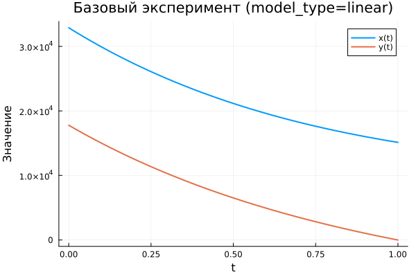
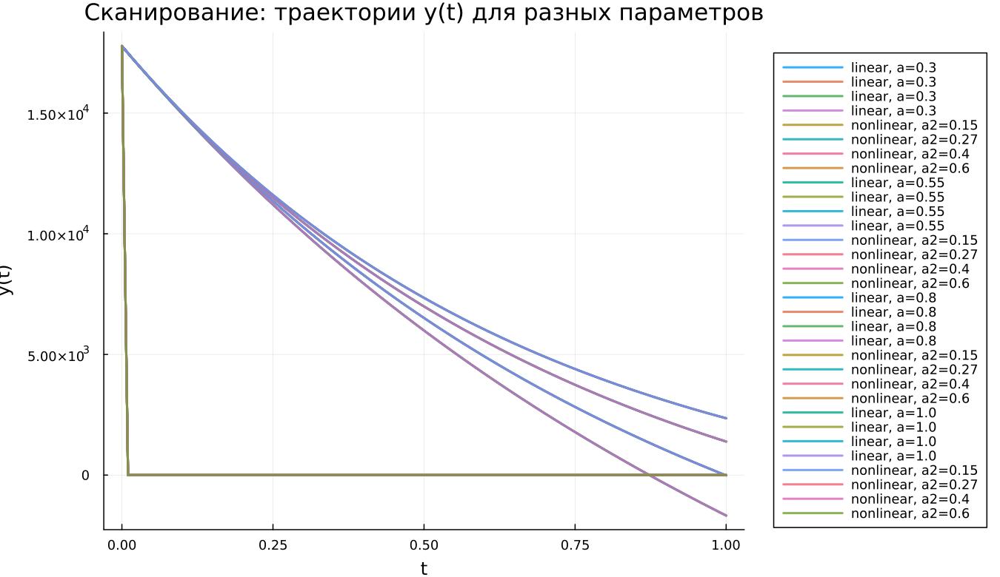

---
## Author
author:
  name: Алькамаль Ибрахим
  email: 1032225432@rudn.ru
  affiliation:
    - name: Российский университет дружбы народов
      country: Российская Федерация
      postal-code: 117198
      city: Москва
      address: ул. Миклухо-Маклая, д. 6

## Title
title: "Математическое моделирование"
subtitle: "Лабораторная работа № 3"
license: "CC BY"
---

# Цель работы

Цель данной лабораторной работы состоит в исследовании простейших математических моделей вооружённого противостояния — моделей Ланчестера. В рамках этих моделей рассматривается взаимодействие двух противоборствующих сторон, представленных регулярными армиями или нерегулярными формированиями. Основной характеристикой системы выступает численность каждой из сторон. Если в некоторый момент времени численность одной из армий становится равной нулю, то данная сторона считается проигравшей, при условии что численность противника остаётся положительной.

# Задание

1. Рассмотреть три варианта моделей Ланчестера.  
2. Построить графики изменения численности противоборствующих армий.  
3. Определить сторону, которая получает преимущество в ходе моделирования.

# Выполнение лабораторной работы

## Теоретические сведения

Рассматриваются три базовых сценария вооружённого конфликта:

1. столкновение регулярных армий;
2. противостояние регулярных войск и партизанских формирований;
3. конфликт между нерегулярными (партизанскими) силами.

### Модель боевых действий между регулярными армиями

Динамика численности регулярных войск определяется несколькими факторами:

1. естественные потери личного состава (болезни, ранения, дезертирство);
2. потери, возникающие непосредственно в результате боевых действий;
3. приток подкреплений.

С учётом перечисленных факторов система уравнений принимает вид

$$
\begin{cases}
\frac{dx}{dt} = -a(t)x(t) - b(t)y(t) + P(t) \\
\frac{dy}{dt} = -c(t)x(t) - h(t)y(t) + Q(t)
\end{cases}
$$

Слагаемые $-a(t)x(t)$ и $-h(t)y(t)$ описывают небоевые потери. Члены $-b(t)y(t)$ и $-c(t)x(t)$ отражают интенсивность потерь в результате столкновения сторон. Коэффициенты $b(t)$ и $c(t)$ характеризуют эффективность вооружённых сил противника, тогда как параметры $a(t)$ и $h(t)$ учитывают влияние внешних факторов. Функции $P(t)$ и $Q(t)$ задают скорость поступления подкреплений.

### Модель взаимодействия регулярных войск и партизанских формирований

Если в конфликте участвуют партизанские отряды, характер потерь меняется. Нерегулярные формирования действуют рассредоточенно и скрытно, что снижает их уязвимость. В таких условиях противнику приходится наносить удары по площади, а не по конкретным целям. Поэтому интенсивность потерь партизан зависит как от численности регулярных войск, так и от количества самих партизан.

Математическая модель принимает форму

$$
\begin{cases}
\frac{dx}{dt} = -a(t)x(t) - b(t)y(t) + P(t) \\
\frac{dy}{dt} = -c(t)x(t)y(t) - h(t)y(t) + Q(t)
\end{cases}
$$

### Модель противостояния партизанских отрядов

Если обе стороны представлены нерегулярными формированиями, то характер взаимодействия становится симметричным. Тогда динамика системы описывается уравнениями

$$
\begin{cases}
\frac{dx}{dt} = -a(t)x(t) - b(t)x(t)y(t) + P(t) \\
\frac{dy}{dt} = -h(t)y(t) - c(t)x(t)y(t) + Q(t)
\end{cases}
$$

### Упрощённая модель Ланчестера

В наиболее простой постановке коэффициенты $b$ и $c$ считаются постоянными, а небоевые потери и подкрепления не учитываются. Предполагается, что каждый солдат армии $x$ уничтожает за единицу времени $c$ бойцов армии $y$, а каждый солдат армии $y$ — $b$ бойцов армии $x$.

Тогда система уравнений принимает вид

$$
\begin{cases}
\frac{dx}{dt} = -by \\
\frac{dy}{dt} = -ax
\end{cases}
$$

Решение этой системы приводит к соотношению

$$
\frac{dx}{dy} = \frac{by}{cx}
$$

Интегрируя выражение, получаем

$$
cx\,dx = by\,dy
$$

и, следовательно,

$$
cx^2 - by^2 = C
$$

Таким образом, изменение численности армий происходит вдоль гиперболы. Конкретная траектория определяется начальными условиями.

{ #fig:001 width=70% height=70% }

Гиперболы разделяются прямой

$$
\sqrt{cx} = \sqrt{by}
$$

Если начальная точка располагается выше данной прямой, то армия $y$ получает преимущество и армия $x$ со временем уничтожается. Если начальное состояние находится ниже разделяющей линии, победа остаётся за армией $x$. В случае расположения на самой границе обе стороны постепенно истощают свои ресурсы, и конфликт затягивается на неопределённо долгий период.

Из модели следует важный вывод: для противостояния более многочисленному противнику требуется существенно более высокая эффективность вооружения. Например, если противник превосходит по численности в два раза, эффективность вооружения должна быть примерно в четыре раза выше.

Следует отметить, что данная модель носит идеализированный характер и используется главным образом для первичного анализа.

### Упрощённая модель для регулярных войск и партизан

При тех же упрощающих предположениях система принимает вид

$$
\begin{cases}
\frac{dx}{dt} = -by(t) \\
\frac{dy}{dt} = -cx(t)y(t)
\end{cases}
$$

Эта система сводится к выражению

$$
\frac{d}{dt}\left(\frac{b}{2}x^2(t) - cy(t)\right) = 0
$$

Откуда следует интеграл движения

$$
\frac{b}{2}x^2(t) - cy(t) =
\frac{b}{2}x^2(0) - cy(0) = C_1
$$

{ #fig:002 width=70% height=70% }

Из анализа фазовых траекторий следует:

- при $C_1 > 0$ преимущество получает регулярная армия;
- при $C_1 < 0$ победу одерживают партизанские формирования.

Чтобы партизанские силы могли одержать победу, необходимо увеличить коэффициент эффективности $c$ и начальную численность отрядов. Причём требуемый рост численности пропорционален квадрату начальной численности регулярных войск $x(0)$.

Следовательно, в данной модели регулярная армия изначально находится в более выгодном положении.

## Задача

Рассматривается вооружённый конфликт между странами $X$ и $Y$.  
Численности армий описываются функциями $x(t)$ и $y(t)$.

В начальный момент времени:

- армия страны $X$ насчитывает 32888 человек;
- армия страны $Y$ — 17777 человек.

Предполагается, что коэффициенты $a$, $b$, $c$, $h$ являются постоянными величинами.  
Функции подкрепления $P(t)$ и $Q(t)$ считаются непрерывными.

Необходимо построить графики изменения численности армий для следующих моделей.

### 1. Модель взаимодействия регулярных армий

$$
\begin{cases}
\frac{dx}{dt}= -0.55x(t) - 0.77y(t) + 1.5\sin(3t+1) \\
\frac{dy}{dt}= -0.66x(t) - 0.44y(t) + 1.2\cos(t+1)
\end{cases}
$$

### 2. Модель взаимодействия регулярных войск и партизан

$$
\begin{cases}
\frac{dx}{dt}= -0.27x(t) - 0.88y(t) + \sin(20t) \\
\frac{dy}{dt}= -0.68x(t)y(t) - 0.37y(t) + \cos(10t)
\end{cases}
$$

Для проведения численного моделирования и построения графиков были использованы внешние программные модули:





## Базовые эксперименты

### Линейная модель (model_type = linear)

График демонстрирует изменение переменных $x(t)$ и $y(t)$ во времени. Обе функции уменьшаются по мере развития системы.

Переменная $x(t)$ убывает постепенно и остаётся положительной на протяжении всего интервала интегрирования. Такое поведение отражает плавное затухание динамики.

Переменная $y(t)$ уменьшается быстрее и к концу интервала становится близкой к нулю. Подобная динамика характерна для линейных систем, решения которых экспоненциально стремятся к стационарному состоянию.

### Нелинейная модель (model_type = nonlinear)

В нелинейной системе наблюдается иная картина. Переменная $x(t)$ уменьшается значительно медленнее и сохраняет сравнительно высокие значения.

Переменная $y(t)$ резко падает практически до нуля уже на начальном этапе. После этого её значение остаётся близким к нулю на всём интервале времени.

Такое поведение объясняется влиянием нелинейных членов системы, которые существенно ускоряют затухание одной из переменных.

## Параметрическое исследование

### Траектории $x(t)$ при различных параметрах

В ходе исследования изменялись параметры модели. Для линейной системы варьировался коэффициент $a$, а для нелинейной — параметр $a_2$.

Наблюдается следующая зависимость:

- при малых значениях параметра функция $x(t)$ уменьшается медленно;
- при увеличении параметра скорость убывания возрастает;
- различия между траекториями становятся заметны уже в середине интервала моделирования.

В нелинейной модели влияние параметров также проявляется, однако форма кривых усложняется из-за нелинейных эффектов.

### Траектории $y(t)$ при различных параметрах

Аналогичный анализ был проведён для переменной $y(t)$.

В линейной модели изменение параметра постепенно изменяет форму траектории и ускоряет стремление функции к нулю.

В нелинейной системе переменная $y(t)$ практически мгновенно обнуляется вне зависимости от значения параметра. Это указывает на доминирующее влияние нелинейных членов системы.

## Время вычислений

Проведено сравнение времени численного решения системы дифференциальных уравнений.

Полученные результаты показывают:

- линейная модель решается быстрее;
- время вычисления линейной системы составляет порядка $10^{-5}$ секунд;
- для нелинейной модели время решения находится в диапазоне $7\cdot10^{-4}$–$9\cdot10^{-4}$ секунд.

Несмотря на различия, абсолютные значения времени вычислений остаются очень малыми.

## Анализ метрики norm_final

В качестве итогового показателя состояния системы используется величина

$$
\text{norm\_final} =
\sqrt{x(t_{final})^2 + y(t_{final})^2}
$$

Эта метрика характеризует величину состояния системы в конце интервала моделирования.

Анализ показывает:

- при увеличении параметра значение метрики уменьшается;
- линейная модель быстрее стремится к состоянию покоя;
- нелинейная система сохраняет более высокие значения нормы.

Следовательно, линейная система быстрее теряет динамическую активность.

# Выводы

1. Линейная модель демонстрирует устойчивую динамику: обе переменные постепенно уменьшаются во времени, причём $y(t)$ стремится к нулю быстрее.  
2. В нелинейной системе переменная $y(t)$ быстро исчезает, и дальнейшая динамика определяется главным образом переменной $x(t)$.  
3. Параметры модели оказывают заметное влияние на скорость изменения решений, особенно в линейной системе.  
4. В нелинейной модели воздействие параметров на переменную $y(t)$ оказывается менее выраженным из-за быстрого подавления её динамики.  
5. Линейная модель требует значительно меньше вычислительных ресурсов, однако даже для нелинейной системы время расчёта остаётся крайне малым.  
6. Метрика $\text{norm\_final}$ уменьшается с ростом параметров, что свидетельствует об усилении затухания динамики системы.

Полученные результаты согласуются с теоретическими свойствами линейных и нелинейных дифференциальных систем и подтверждают корректность проведённого численного моделирования.

# Список литературы {.unnumbered}

1. [Законы Осипова — Ланчестера](https://ru.wikipedia.org/wiki/Законы_Осипова_—_Ланчестера)  
2. [Дифференциальные уравнения динамики боя](https://zen.yandex.ru/media/id/5fd3c685994c494848984b63/differencialnye-uravneniia-dinamiki-boia-5fd4bcc45a2c8e1f2cc208f1)  
3. [Элементарные модели боя](https://intuit.ru/studies/educational_groups/594/courses/499/lecture/11353?page=7)
