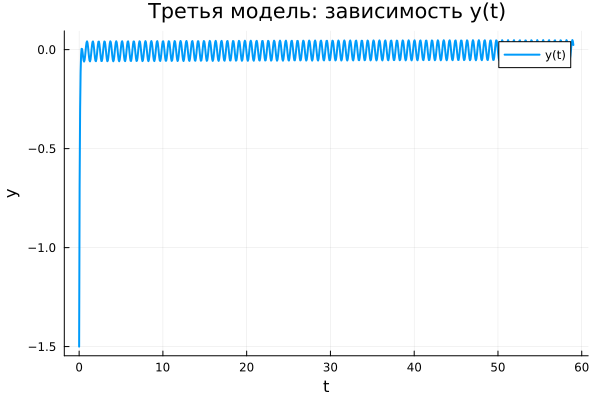

---
## Author
author:
  name: Алькамаль Ибрахим
  email: 1032225432@rudn.ru
  affiliation:
    - name: Российский университет дружбы народов
      country: Российская Федерация
      postal-code: 117198
      city: Москва
      address: ул. Миклухо-Маклая, д. 6

## Title
title: "Математическое моделирование"
subtitle: "Лабораторная работа № 4"
license: "CC BY"
date: today
date-format: "YYYY-MM-DD"
---

# Вводная часть

## Цель работы

Изучить уравнение гармонического осциллятора и исследовать его поведение в трёх случаях:

1. без затухания;
2. с затуханием;
3. с затуханием и внешней силой.

## Задание

1. Построить решение уравнения гармонического осциллятора без затухания.
2. Записать уравнение свободных колебаний гармонического осциллятора с затуханием и построить его решение.
3. Построить фазовый портрет гармонических колебаний с затуханием.
4. Записать уравнение колебаний при наличии внешней силы.
5. Построить решение и фазовый портрет для вынужденных колебаний.

# Теоретические сведения

## Гармонический осциллятор

Линейный гармонический осциллятор описывает широкий круг процессов в физике, химии, биологии и технике.

Общее уравнение имеет вид:

$$
\ddot{x} + 2\gamma \dot{x} + \omega_0^2 x = F(t)
$$

где:

- $x$ — состояние системы;
- $\gamma$ — коэффициент затухания;
- $\omega_0$ — собственная частота;
- $F(t)$ — внешняя сила.

## Осциллятор без затухания

Если потери энергии отсутствуют, получаем уравнение:

$$
\ddot{x} + \omega_0^2 x = 0
$$

Это консервативная система, в которой энергия сохраняется, а колебания остаются периодическими.

## Осциллятор с затуханием

При наличии потерь энергии система описывается уравнением:

$$
\ddot{x} + 2\gamma \dot{x} + \omega_0^2 x = 0
$$

В этом случае амплитуда со временем уменьшается, а система стремится к состоянию покоя.

## Осциллятор с внешней силой

Если на систему действует внешнее периодическое воздействие, уравнение принимает вид:

$$
\ddot{x} + 2\gamma \dot{x} + \omega_0^2 x = F(t)
$$

Внешняя сила поддерживает вынужденные колебания даже при наличии затухания.

# Переход к системе первого порядка

## Без затухания

$$
\begin{cases}
\dot{x} = y \\
\dot{y} = -\omega_0^2 x
\end{cases}
$$

## С затуханием

$$
\begin{cases}
\dot{x} = y \\
\dot{y} = -2\gamma y - \omega_0^2 x
\end{cases}
$$

## С внешней силой

$$
\begin{cases}
\dot{x} = y \\
\dot{y} = F(t) - 2\gamma y - \omega_0^2 x
\end{cases}
$$

## Начальные условия

Для всех моделей использовались условия:

$$
x_0 = 0.5, \qquad y_0 = -1.5
$$

Интервал моделирования:

$$
t \in [0;59]
$$

Шаг интегрирования:

$$
h = 0.05
$$

# Постановка задачи

## Модель 1: без затухания и без внешней силы

$$
\ddot{x} + 5.2x = 0
$$

## Модель 2: с затуханием и без внешней силы

$$
\ddot{x} + 14\dot{x} + 0.5x = 0
$$

## Модель 3: с затуханием и внешней силой

$$
\ddot{x} + 13\dot{x} + 0.3x = 0.8\sin(9t)
$$

# Базовые эксперименты

## Первая модель: решение

## Первая модель: фазовый портрет

## Первая модель: анализ

Для первой модели наблюдаются незатухающие периодические колебания.

Основные особенности:

- амплитуда остаётся практически постоянной;
- колебания регулярны и повторяемы;
- энергия системы сохраняется;
- фазовая траектория замкнута.

Следовательно, модель описывает устойчивые собственные колебания без потерь энергии.

## Вторая модель: решение

## Вторая модель: фазовый портрет

## Вторая модель: анализ

Во второй модели колебательный процесс быстро затухает.

Наблюдения:

- переменная быстро стремится к нулю;
- переходный процесс очень короткий;
- фазовая траектория стягивается к равновесию;
- система переходит в состояние покоя.

Следовательно, данная модель описывает апериодическое затухание.

## Третья модель: решение

## Третья модель: фазовый портрет

## Третья модель: анализ

В третьей модели присутствуют затухание и внешнее периодическое воздействие.

Основные результаты:

- после переходного процесса возникают малые устойчивые колебания;
- решение не стремится точно к нулю;
- внешняя сила поддерживает движение;
- фазовый портрет образует компактную замкнутую область около равновесия.

Следовательно, система выходит на режим вынужденных колебаний.

# Параметрическое исследование

## Сканирование траекторий $x(t)$

## Анализ траекторий $x(t)$

Было проведено параметрическое исследование трёх моделей.

Результаты:

- в первой модели параметр влияет на частоту колебаний;
- во второй модели параметр влияет на скорость затухания;
- в третьей модели параметр изменяет характеристики установившихся вынужденных колебаний.

## Сканирование траекторий $y(t)$

## Анализ траекторий $y(t)$

Для переменной $y(t)$ наблюдаются аналогичные закономерности:

- в первой модели сохраняются устойчивые колебания;
- во второй модели переменная быстро стремится к нулю;
- в третьей модели возникают малые вынужденные колебания.

# Анализ вычислений

## Время вычислений

## Интерпретация времени вычислений

Бенчмаркинг показал:

- первая модель вычисляется быстрее всего;
- вторая модель требует немного больше времени;
- третья модель наиболее затратна из-за внешнего воздействия.

При этом во всех случаях вычислительные затраты остаются очень малыми.

# Анализ итоговой метрики

## Метрика norm_final

Рассматривалась величина:

$$
\text{norm\_final} = \sqrt{x(t_{final})^2 + y(t_{final})^2}
$$

Она характеризует состояние системы в конце моделирования.

## Зависимость norm_final от параметра

## Интерпретация результата

Полученные результаты показывают:

- для первой модели значение остаётся заметным, так как затухания нет;
- для второй модели метрика стремится к нулю;
- для третьей модели значение мало, но не равно нулю из-за вынужденных колебаний.

Метрика хорошо отражает различие в динамике исследуемых систем.

# Итоги

## Выводы

1. Первая модель демонстрирует устойчивые незатухающие колебания.
2. Вторая модель быстро переходит в состояние покоя за счёт затухания.
3. Третья модель выходит на режим установившихся вынужденных колебаний.
4. Параметры модели влияют на частоту, скорость затухания и амплитуду решения.
5. Все модели эффективно вычисляются численно.
6. Метрика $\text{norm\_final}$ подтверждает различие между режимами движения.

