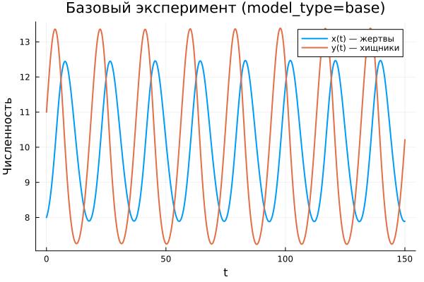
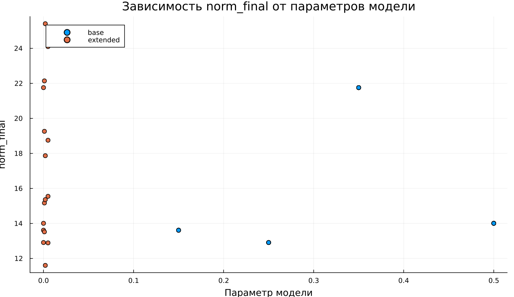
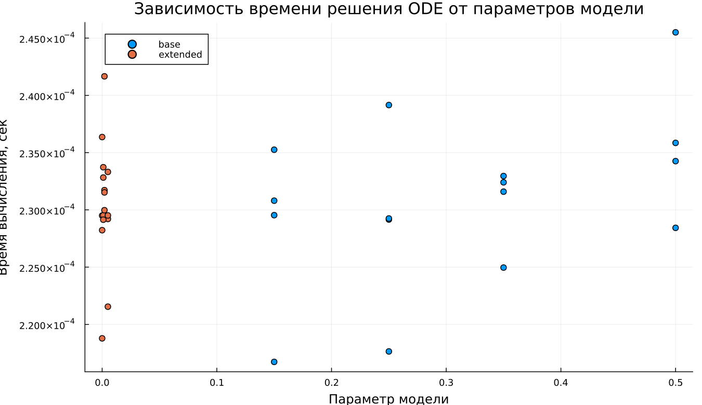

---
## Author
author:
  name: Алькамаль Ибрахим
  email: 1032225432@rudn.ru
  affiliation:
    - name: Российский университет дружбы народов
      country: Российская Федерация
      postal-code: 117198
      city: Москва
      address: ул. Миклухо-Маклая, д. 6

## Title
title: "Математическое моделирование"
subtitle: "Лабораторная работа № 5"
license: "CC BY"
date: today
date-format: "YYYY-MM-DD"
---

# Вводная часть

## Цель работы

Проанализировать динамику системы «хищник–жертва» и сравнить её поведение в классической и модифицированной постановках.

## Задание

1. Построить фазовую зависимость между популяциями.
2. Исследовать временную эволюцию численностей.
3. Определить точки равновесия.
4. Сопоставить поведение базовой и расширенной моделей.
5. Провести анализ чувствительности к параметрам.

# Теоретические сведения

## Модель хищник-жертва

Рассматривается модель Лотки–Вольтерры, описывающая взаимодействие двух популяций.

Обозначим:

- $x(t)$ — численность хищников;
- $y(t)$ — численность жертв.

Тогда динамика системы задаётся уравнениями:

$$
\begin{cases}
\frac{dx}{dt} = -a x(t) + b x(t)y(t), \\
\frac{dy}{dt} = c y(t) - d x(t)y(t).
\end{cases}
$$

## Интерпретация параметров

Параметры модели отражают биологический смысл процессов:

- $a$ характеризует естественное уменьшение численности хищников;
- $b$ описывает прирост хищников за счёт взаимодействия;
- $c$ отвечает за рост популяции жертв;
- $d$ определяет интенсивность их уничтожения.

## Стационарное состояние

Равновесие системы определяется условиями:

$$
\frac{dx}{dt}=0, \qquad \frac{dy}{dt}=0
$$

При положительных значениях переменных:

$$
x_0=\frac{a}{b}, \qquad y_0=\frac{c}{d}
$$

Это состояние соответствует балансу между ростом и убыванием популяций.

# Постановка задачи

## Исследуемая система

Задана система уравнений:

$$
\begin{cases}
\frac{dx}{dt} = -0.25x(t) + 0.025x(t)y(t), \\
\frac{dy}{dt} = 0.45y(t) - 0.045x(t)y(t).
\end{cases}
$$

## Начальные условия

Начальные значения:

$$
x_0 = 8, \qquad y_0 = 11
$$

## Стационарное состояние системы

Подставляя параметры, получаем:

$$
x_0=\frac{0.25}{0.025}=10, \qquad y_0=\frac{0.45}{0.045}=10
$$

Следовательно, точка равновесия:

$$
(10, 10)
$$

# Базовые эксперименты

## Базовая модель: временные зависимости

## Базовая модель: фазовый портрет

## Базовая модель: анализ

Результаты показывают устойчивое периодическое поведение системы.

Характерные особенности:

- обе популяции изменяются циклически;
- амплитуда колебаний практически постоянна;
- переход к равновесию отсутствует;
- фазовая траектория представляет собой замкнутую кривую.

Таким образом, наблюдается классический режим автоколебаний.

## Расширенная модель: временные зависимости

## Расширенная модель: фазовый портрет

## Расширенная модель: анализ

В модифицированной системе сохраняется колебательный характер, однако его свойства изменяются.

Основные наблюдения:

- начальные колебания имеют большую амплитуду;
- со временем амплитуда уменьшается;
- система стремится к устойчивому состоянию;
- фазовая траектория имеет форму сходящейся спирали.

Дополнительный нелинейный член ограничивает рост и стабилизирует динамику.

# Параметрическое исследование

## Сканирование траекторий $x(t)$

## Анализ траекторий $x(t)$

Рассмотрено влияние параметров на поведение системы.

Выводы:

- в базовой модели параметр $a$ изменяет форму колебаний;
- периодический режим сохраняется;
- в расширенной модели параметр $k$ ускоряет затухание;
- увеличение $k$ способствует быстрому выходу на равновесие.

## Сканирование траекторий $y(t)$

## Анализ траекторий $y(t)$

Для переменной $y(t)$ наблюдается сходная картина:

- базовая модель демонстрирует устойчивую периодичность;
- расширенная — постепенное затухание;
- усиление нелинейности ускоряет стабилизацию;
- система стремится к стационарному режиму.

## Фазовые траектории

## Анализ фазовых траекторий

Фазовые портреты подчёркивают различие динамики:

- в базовой модели — замкнутые траектории;
- в расширенной — сходящиеся спирали;
- первая система сохраняет колебания;
- вторая стремится к равновесию.

# Анализ итоговой метрики

## Метрика norm_final

Рассматривается величина:

$$
\text{norm\_final} = \sqrt{x(t_{final})^2 + y(t_{final})^2}
$$

## Зависимость norm_final от параметра

## Интерпретация результата

Анализ показывает:

- в базовой модели метрика остаётся значительной из-за отсутствия затухания;
- её значение зависит от текущей фазы колебаний;
- в расширенной модели метрика отражает положение равновесия;
- система после переходного процесса стабилизируется.

# Анализ вычислений

## Время вычислений

## Интерпретация времени вычислений

Результаты вычислительного анализа:

- обе модели требуют малых затрат времени;
- изменение параметров практически не влияет на скорость расчёта;
- усложнение модели не приводит к существенному росту вычислений.

Следовательно, выбранный численный метод является эффективным.

# Итоги

## Выводы

1. Базовая модель демонстрирует устойчивые незатухающие колебания.
2. Расширенная модель приводит к затухающей динамике и установлению равновесия.
3. Фазовые портреты отражают различие типов движения.
4. Параметры существенно влияют на характеристики системы.
5. Метрика $\text{norm\_final}$ позволяет различать режимы поведения.
6. Численные методы обеспечивают быструю и стабильную обработку обеих моделей.
