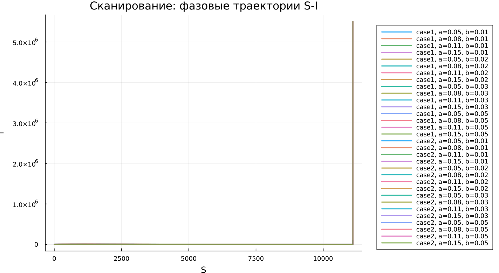

---
## Author
author:
  name: Алькамаль Ибрахим
  email: 1032225432@rudn.ru
  affiliation:
    - name: Российский университет дружбы народов
      country: Российская Федерация
      postal-code: 117198
      city: Москва
      address: ул. Миклухо-Маклая, д. 6

## Title
title: "Математическое моделирование"
subtitle: "Лабораторная работа № 6"
license: "CC BY"
---

# Цель работы

Изучить эпидемиологическую модель $SIR$ и исследовать особенности изменения численности основных групп населения в процессе распространения заболевания.

# Задание

1. Ознакомиться с математической моделью эпидемии.
2. Построить графики изменения количества особей в трёх группах модели.
3. Проанализировать развитие эпидемии для двух случаев: $I(0)\leq I^*$ и $I(0)>I^*$.

# Выполнение лабораторной работы

## Теоретические сведения

Рассмотрим простую модель распространения эпидемии в изолированной популяции. Пусть общее число особей равно $N$. В рамках модели всё население делится на три группы.

Первая группа включает восприимчивых к заболеванию, но ещё не инфицированных особей. Их количество обозначается через $S(t)$.

Вторая группа состоит из инфицированных особей, которые являются носителями болезни и могут передавать инфекцию другим. Их число обозначается через $I(t)$.

Третья группа описывает особей, которые уже не участвуют в распространении заболевания, например выздоровели и получили иммунитет. Их количество обозначается через $R(t)$.

До тех пор, пока число инфицированных не превышает критический уровень $I^*$, будем считать, что заболевшие изолированы и не заражают восприимчивых особей. Если же выполняется условие $I(t)>I^*$, то инфекция начинает распространяться среди здоровых восприимчивых особей.

Поэтому изменение количества восприимчивых особей описывается следующим образом:

$$
\frac{dS}{dt}=
 \begin{cases}
    -\alpha S, &\text{если $I(t)>I^*$},\\
    0, &\text{если $I(t)\leq I^*$}.
 \end{cases}
$$

Каждая восприимчивая особь, которая заражается, переходит в группу инфицированных. Поэтому скорость изменения числа инфицированных определяется разностью между количеством новых заражённых и количеством тех, кто выходит из группы больных вследствие выздоровления:

$$
\frac{dI}{dt}=
 \begin{cases}
    \alpha S-\beta I, &\text{если $I(t)>I^*$},\\
    -\beta I, &\text{если $I(t)\leq I^*$}.
 \end{cases}
$$

Число выздоровевших или выбывших из процесса распространения болезни особей изменяется по закону:

$$
\frac{dR}{dt}=\beta I.
$$

Здесь $\alpha$ — коэффициент заболеваемости, а $\beta$ — коэффициент выздоровления.

Для однозначного определения решения системы необходимо задать начальные условия. В начальный момент времени $t=0$ известны значения $S(0)$, $I(0)$ и $R(0)$. Для анализа модели требуется рассмотреть два режима распространения заболевания:

1. $I(0)\leq I^*$;
2. $I(0)>I^*$.

### Задача

На острове началась эпидемия. Известно, что общее число жителей составляет

$$
N=11400.
$$

В начальный момент времени $t=0$ число инфицированных людей, являющихся распространителями болезни, равно

$$
I(0)=250.
$$

Количество людей, уже имеющих иммунитет к заболеванию, равно

$$
R(0)=47.
$$

Следовательно, число восприимчивых к болезни, но ещё здоровых людей в начальный момент времени определяется выражением

$$
S(0)=N-I(0)-R(0).
$$

Необходимо построить графики изменения численности групп $S(t)$, $I(t)$ и $R(t)$, а также рассмотреть развитие эпидемии в двух случаях:

1. $I(0)\leq I^*$;
2. $I(0)>I^*$.

Для численного моделирования и построения графиков использовались внешние файлы с программным кодом:





## Базовые эксперименты

### Первая модель $(model\_type = case1)$

Для первой модели получается нестандартная динамика. Количество восприимчивых особей $S(t)$ не изменяется с течением времени, поскольку в данном случае выполняется уравнение $dS/dt=0$. Одновременно с этим число инфицированных $I(t)$ растёт по экспоненциальному закону, а величина $R(t)$ уменьшается и может принимать отрицательные значения.

Такой результат нельзя считать корректным с точки зрения классической эпидемиологической интерпретации. В модели отсутствует механизм, который ограничивал бы рост числа инфицированных. Кроме того, нарушается физический смысл переменной $R(t)$, так как количество выбывших или выздоровевших особей не должно становиться отрицательным.

Фазовый портрет также подтверждает эту особенность. Поскольку $S(t)$ остаётся постоянным, траектория практически превращается в вертикальную линию. Это означает, что изменение состояния системы происходит только за счёт переменной $I(t)$, а сама модель фактически сводится к одномерной динамике.

Следовательно, первая модель описывает неограниченное увеличение числа инфицированных без выхода к устойчивому состоянию. Поэтому её нельзя рассматривать как адекватное описание реального эпидемического процесса.

### Вторая модель $(model\_type = case2)$

Во второй модели наблюдается поведение, характерное для классической $SIR$-системы. Число восприимчивых особей $S(t)$ постепенно уменьшается, что соответствует процессу заражения. Число инфицированных $I(t)$ сначала возрастает, затем достигает максимального значения, после чего начинает снижаться и стремится к нулю. При этом число выбывших $R(t)$ монотонно увеличивается.

Такая динамика хорошо согласуется с представлением об эпидемии в популяции конечной численности. В начале процесса инфекция активно распространяется. Затем, по мере уменьшения числа восприимчивых особей, скорость заражения снижается, и эпидемия постепенно затухает.

Фазовая траектория имеет вид незамкнутой кривой. Сначала она поднимается вверх, что соответствует росту $I(t)$ при уменьшении $S(t)$. Затем траектория опускается вниз, отражая спад числа инфицированных. Такой вид фазового портрета показывает прохождение системой максимума заболеваемости и дальнейший переход к затуханию эпидемии.

В отличие от первой модели, во втором случае система стремится к стационарному состоянию:

$$
I(t)\to 0.
$$

При этом $S(t)$ выходит на некоторый остаточный уровень, а $R(t)$ достигает конечного значения.

## Параметрическое сканирование

### Траектории $S(t)$ для различных параметров

Анализ изменения $S(t)$ показывает, что модели по-разному реагируют на изменение параметров. В первой модели $(case1)$ количество восприимчивых особей остаётся постоянным для всех рассмотренных значений параметров. Это напрямую связано с уравнением $dS/dt=0$. Следовательно, изменение коэффициентов не влияет на динамику восприимчивой группы.

Во второй модели $(case2)$ величина $S(t)$ убывает. Скорость этого убывания зависит от параметра $a$. Чем больше значение $a$, тем быстрее уменьшается число восприимчивых особей, что соответствует более интенсивному распространению заболевания.

Основные выводы по графикам:

- в первой модели $S(t)$ сохраняет постоянное значение;
- во второй модели $S(t)$ монотонно уменьшается;
- параметр $a$ влияет на скорость сокращения группы восприимчивых особей.

### Траектории $I(t)$ для различных параметров

Для первой модели во всех рассмотренных случаях наблюдается экспоненциальное увеличение числа инфицированных $I(t)$. При росте параметра $b$ скорость увеличения становится значительно выше, что приводит к очень большим значениям количества инфицированных.

Во второй модели поведение существенно отличается. Сначала число инфицированных растёт, затем достигает пикового значения, после чего начинает уменьшаться. Параметр $a$ влияет как на высоту пика, так и на момент его достижения. При больших значениях $a$ максимум достигается быстрее, но после этого быстрее начинается спад.

Итак:

- первая модель показывает неограниченный рост $I(t)$;
- вторая модель воспроизводит типичную эпидемическую волну;
- параметры определяют скорость распространения инфекции и масштаб максимальной заболеваемости.

### Траектории $R(t)$ для различных параметров

Для первой модели величина $R(t)$ уменьшается и со временем становится отрицательной. При этом модуль отрицательных значений быстро возрастает. Такая динамика указывает на некорректность модели, поскольку переменная $R(t)$ должна иметь физически осмысленные неотрицательные значения.

Во второй модели наблюдается противоположная ситуация. Значение $R(t)$ монотонно возрастает и постепенно стремится к некоторому предельному уровню. Параметры влияют на скорость накопления выбывших особей: при более интенсивном распространении инфекции группа $R(t)$ увеличивается быстрее.

Следовательно:

- в первой модели $R(t)$ принимает нефизичные отрицательные значения;
- во второй модели $R(t)$ корректно описывает накопление переболевших или выбывших особей;
- параметры изменяют скорость достижения предельного состояния.

### Фазовые траектории для различных параметров

Фазовые портреты позволяют наглядно увидеть качественное отличие двух моделей.

В первой модели все фазовые траектории вырождаются в вертикальные линии, поскольку переменная $S(t)$ не меняется. Это говорит о том, что полноценной двумерной динамики в плоскости $(S,I)$ не возникает.

Во второй модели фазовые траектории имеют характерный вид кривых, описывающих эпидемический процесс. Сначала при уменьшении $S(t)$ происходит рост $I(t)$, затем число инфицированных начинает снижаться при дальнейшем уменьшении числа восприимчивых.

Таким образом, изменение параметров не меняет основного характера моделей:

- первая модель остаётся вырожденной;
- вторая модель сохраняет реалистичную эпидемическую динамику.

### Анализ метрики $norm\_final$

В ходе анализа рассматривалась метрика

$$
\text{norm\_final}=
\sqrt{S(t_{final})^2+I(t_{final})^2+R(t_{final})^2}.
$$

Для первой модели значение $\text{norm\_final}$ быстро увеличивается при росте параметра $b$. Это связано с экспоненциальным увеличением $I(t)$ и одновременным уходом $R(t)$ в отрицательную область. В результате норма итогового состояния становится очень большой.

Для второй модели значения данной метрики оказываются значительно меньше и изменяются более плавно. Это объясняется тем, что система постепенно переходит к стационарному состоянию, при котором

$$
I(t)\to 0,
$$

а значения $S(t)$ и $R(t)$ остаются конечными.

Следовательно:

- в первой модели метрика может расти без ограничения;
- во второй модели она характеризует конечное устойчивое состояние системы.

### Анализ максимального числа инфицированных

Максимальное число инфицированных $I_{max}$ существенно зависит от параметров модели.

В первой модели $I_{max}$ принимает очень большие значения. Это объясняется отсутствием механизма, ограничивающего рост числа инфицированных. При увеличении параметра $b$ максимум $I(t)$ резко возрастает.

Во второй модели величина $I_{max}$ остаётся конечной. Она зависит от параметра $a$: при увеличении интенсивности заражения пик инфицированных достигается быстрее, однако его значение остаётся ограниченным особенностями системы и конечностью популяции.

Таким образом:

- первая модель приводит к неограниченному увеличению $I_{max}$;
- вторая модель описывает контролируемую эпидемическую волну;
- максимальная заболеваемость во второй модели определяется параметрами распространения инфекции.

### Время вычислений

Результаты бенчмаркинга показывают, что время численного решения во всех проведённых экспериментах остаётся малым и имеет один порядок величины:

$$
\sim 10^{-4}\ \text{сек}.
$$

Для обеих моделей изменение параметров почти не влияет на вычислительные затраты. Небольшие колебания времени можно объяснить особенностями работы численного метода, а также использованием адаптивного шага интегрирования.

Можно сделать следующие выводы:

- обе модели эффективно решаются численными методами;
- изменение параметров практически не увеличивает вычислительную сложность;
- даже при быстром росте решений в первой модели время вычислений остаётся небольшим.

## Выводы

1. Первая модель $(case1)$ показывает экспоненциальный рост числа инфицированных при постоянном числе восприимчивых. Такое поведение указывает на нефизичность модели и отсутствие механизма стабилизации.
2. Вторая модель $(case2)$ воспроизводит типичную динамику эпидемии: сначала число инфицированных растёт, затем достигает максимума, после чего уменьшается и стремится к нулю.
3. Фазовые портреты подтверждают качественное различие моделей. В первой модели траектории вырождаются в вертикальные линии, а во второй формируются полноценные кривые, отражающие ход эпидемического процесса.
4. Параметры $a$ и $b$ существенно влияют на поведение системы. Параметр $a$ определяет скорость уменьшения числа восприимчивых особей, а параметр $b$ влияет на интенсивность изменения числа инфицированных.
5. Метрика $\text{norm\_final}$ позволяет количественно различить результаты моделирования. В первой модели она быстро возрастает, а во второй стабилизируется и отражает конечное состояние системы.
6. Максимальное число инфицированных $I_{max}$ в первой модели растёт практически без ограничения, тогда как во второй модели оно остаётся конечным.
7. Численное решение обеих моделей выполняется эффективно. Изменение параметров оказывает минимальное влияние на время вычислений.

# Список литературы {.unnumbered}

1. [Конструирование эпидемиологических моделей](https://habr.com/ru/post/551682/)
2. [Зараза, гостья наша](https://nplus1.ru/material/2019/12/26/epidemic-math)
